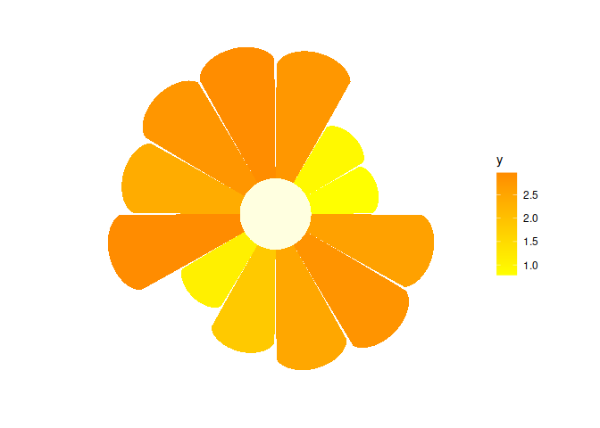
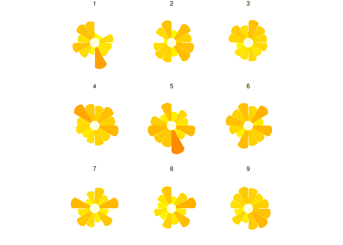
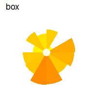
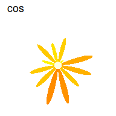

<!-- README.md is generated from README.Rmd. Please edit that file -->

# ggflower

<!-- badges: start -->

[](https://github.com/srvanderplas/ggflower/actions/workflows/R-CMD-check.yaml)
[](https://codecov.io/gh/srvanderplas/ggflower)
[](https://lifecycle.r-lib.org/articles/stages.html#experimental)
[](https://github.com/srvanderplas/ggflower/actions/workflows/pkgdown.yaml)
[](https://github.com/srvanderplas/ggflower/actions/workflows/test-coverage.yaml)
<!-- badges: end -->

The goal of ggflower is to provide flower-like charts using the grammar
of graphics API in ggplot2. These charts are intended primarily to draw
viewers in, rather than to accurately display data, as we know that
radar charts (which are the broader class of charts that encompass
flower charts) are harder to use to identify differences and make
comparisons.

## Installation

You can install the development version of ggflower from
[GitHub](https://github.com/) with:

``` r
# install.packages("devtools")
devtools::install_github("drbradford12/ggflower")
```

## Example

`ggflower` works by creating a “petal” shape for each categorical x
variable and then using polar coordinates to turn these values into a
flower shape.

``` r
library(ggplot2)
library(ggflower)
#> Loading required package: dplyr
#> 
#> Attaching package: 'dplyr'
#> The following objects are masked from 'package:stats':
#> 
#>     filter, lag
#> The following objects are masked from 'package:base':
#> 
#>     intersect, setdiff, setequal, union
#> Loading required package: magrittr
#> Loading required package: tidyr
#> 
#> Attaching package: 'tidyr'
#> The following object is masked from 'package:magrittr':
#> 
#>     extract
#> Loading required package: purrr
#> 
#> Attaching package: 'purrr'
#> The following object is masked from 'package:magrittr':
#> 
#>     set_names
## basic example code
n <- 4
dframe <- data.frame(index = 1:n, y = n:1)

# don't do this - use polar coordinates
dframe |>
  ggplot(aes(x = index, y = y)) +
  geom_flower(aes(fill = factor(index)), shape="heart") 
#> Warning in draw_panel(..., self = self): geom_flower should only be used in polar coordinates.
#>               Mappings to y are not linear.
#>               Add + coord_polar() to your call.
```


``` r


dframe |>
  ggplot(aes(x = index, y = y)) +
  geom_flower(aes(fill = factor(index)), shape="heart") +
  coord_polar()
```


As a result, it is critical that you use `coord_polar()` with `ggflower`
plots.

`ggflower` works well with facets and other `ggplot2` geoms.

``` r

n <- 12
dframe <- data.frame(index = 1:n, y = abs(rnorm(n, mean=2)))

dframe |>
  ggplot(aes(x = index, y = y)) +
  geom_flower(aes(fill = y), shape="circle", colour = NA) +
  coord_polar() +
  theme_void() +
  scale_fill_gradient(low="yellow", high="darkorange")
```



``` r


n <- 12
k <- 9
dframe <- data.frame(
  expand.grid(
  index = 1:n, facet=1:k), y = abs(rnorm(n*k, mean=2)))

dframe |>
  ggplot(aes(x = index, y = y)) +
  geom_flower(shape="circle", aes(fill = y), colour=NA) +
  facet_wrap(~facet) +
  coord_polar() +
  theme_void() +
  scale_fill_gradient(low="yellow", high="darkorange") +
  theme(legend.position = "none")
```



There are several different petal types available:

``` r
set.seed(3425)
n <- 12
dframe <- data.frame(index = 1:n, y = abs(rnorm(n, mean = 2)))

shapes <- c("box", "cos", "normal", "circle", "heart")
for (i in shapes) {
  dframe |>
    (\(df) ggplot(df, aes(x = index, y = y)) +
       geom_flower(aes(fill = y), shape=i, colour = NA) +
       coord_polar() +
       theme_void() +
       ggtitle(i) + 
       scale_fill_gradient(low="yellow", high="darkorange", 
                           guide = 'none')
    )() |>
    print()
}
```


