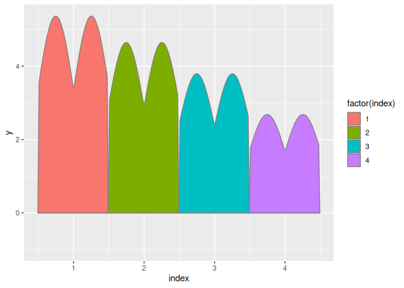
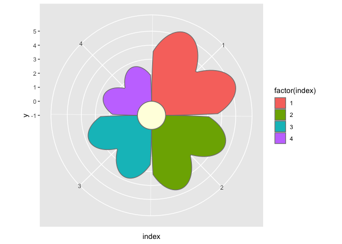
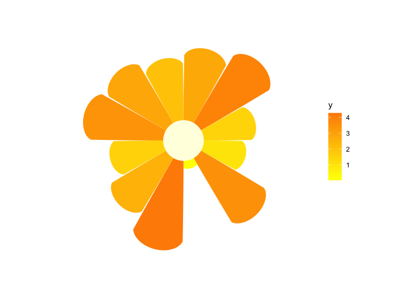
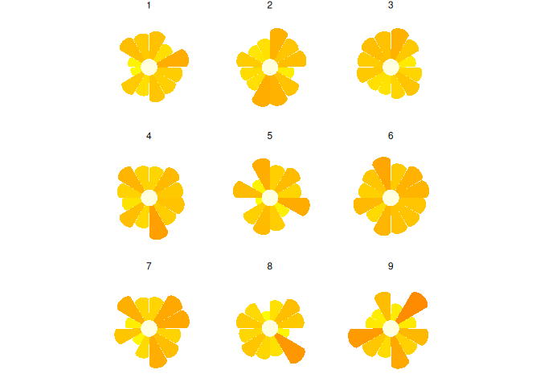

<!-- README.md is generated from README.Rmd. Please edit that file -->

# ggflower

<!-- badges: start -->

[](https://github.com/drbradford12/ggflower/actions/workflows/R-CMD-check.yaml)
<!-- badges: end -->

The goal of ggflower is to …

## Installation

You can install the development version of ggflower from
[GitHub](https://github.com/) with:

``` r
# install.packages("devtools")
devtools::install_github("drbradford12/ggflower")
```

## Example

This is a basic example which shows you how to solve a common problem:

``` r
library(ggplot2)
library(ggflower)
#> Loading required package: dplyr
#> 
#> Attaching package: 'dplyr'
#> The following objects are masked from 'package:stats':
#> 
#>     filter, lag
#> The following objects are masked from 'package:base':
#> 
#>     intersect, setdiff, setequal, union
#> Loading required package: magrittr
#> Loading required package: tidyr
#> 
#> Attaching package: 'tidyr'
#> The following object is masked from 'package:magrittr':
#> 
#>     extract
#> Loading required package: purrr
#> 
#> Attaching package: 'purrr'
#> The following object is masked from 'package:magrittr':
#> 
#>     set_names
## basic example code
n <- 4
dframe <- data.frame(index = 1:n, y = n:1)

# don't do this - use polar coordinates
dframe |>
  ggplot(aes(x = index, y = y)) +
  geom_flower(aes(fill = factor(index)), shape="heart") 
#> Warning in draw_panel(..., self = self): geom_flower should only be used in polar coordinates.
#>               Mappings to y are not linear.
#>               Add + coord_polar() to your call.
```



``` r


dframe |>
  ggplot(aes(x = index, y = y)) +
  geom_flower(aes(fill = factor(index)), shape="heart") +
  coord_polar()
```



``` r


n <- 12
dframe <- data.frame(index = 1:n, y = abs(rnorm(n, mean=2)))

dframe |>
  ggplot(aes(x = index, y = y)) +
  geom_flower(aes(fill = y), shape="circle", colour = NA) +
  coord_polar() +
  theme_void() +
  scale_fill_gradient(low="yellow", high="darkorange")
```



``` r


n <- 12
k <- 9
dframe <- data.frame(
  expand.grid(
  index = 1:n, facet=1:k), y = abs(rnorm(n*k, mean=2)))

dframe |>
  ggplot(aes(x = index, y = y)) +
  geom_flower(shape="circle", aes(fill = y), colour=NA) +
  facet_wrap(~facet) +
  coord_polar() +
  theme_void() +
  scale_fill_gradient(low="yellow", high="darkorange") +
  theme(legend.position = "none")
```


